```{r setup, include=FALSE}
knitr::opts_chunk$set(echo = TRUE)
```
## Cluster analysis

Preparation of the Environment and aesthetics

```{r, echo = TRUE}
library(pacman) #' Environment preparation
pacman::p_load(plyr,psych,openxlsx,fpc,pvclust,cluster,mclust,
               factoextra,flexclust,reshape,knitr,dendextend,plotly,
               dplyr,magrittr,ggpubr,corrplot,ggthemes,scales) # added for MDS and intervariable correlation
setwd('/Users/williamcruz/Desktop/4_COMPU_SCI/B_WebsiteW/WebsiteW/content/project/Hyerarchical-Analysis/dta')
dt <- read.xlsx('dt.xlsx',sheet = 3, rowNames = TRUE)
```
Before starting the cluster analysis it is preferred to leave the most informative variables in the data set, for doing it so a common way to visualize correlation matrices is a heatmap which can identify what variables have a small or non correlation with each other.
From the heatmap below as well as from the correlation coefficient table we can identify that at least two variables `targe` and `route` have small (> 0.35 & >-0.35) correlation coefficients, thus and for further analyses these two variables will be excluded from further analyses.
```{r, echo = TRUE}
res.cor <- cor(dt, method = 'spearman')       # correlation matrix
mds.cor <- (1- res.cor) %>%                   # using MDS to reveal hidden patterns in correlation matrix
  cmdscale() %>%
  as_tibble()
colnames(mds.cor) <- c('Dim.1','Dim.2')
plot_cor01 <- ggscatter(mds.cor, x = 'Dim.1', y = 'Dim.2',
                        label = colnames(res.cor),
                        size = 1,
                        repel = T)+
  theme_classic() +
  ggtitle('MDS for correlation coefficient between variables')
plot_cor01
plot_cor02 <- corrplot::corrplot(res.cor)
t00 <- kable(res.cor, format = "html", digits = 2)
t00
```
MDS Correlation             |  Heatmap Correlation
:-------------------------:|:-------------------------:
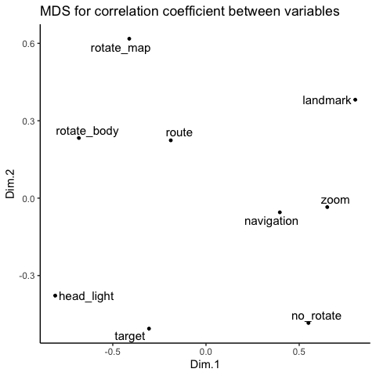  |  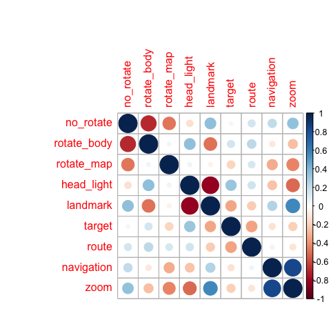

Next, some of the preliminary steps included remove missing values and scale the data as shown below
```{r}
mydata <- subset(dt,select=c(1:5,8:9))
mydata <- na.omit(mydata)                               # listwise deletion of missing data
mydata <- scale(mydata, center = TRUE, scale = TRUE)    # scale the data 
```

### Hierarchical Clustering methods

The next step consist in assessing different hierarchical clustering (HC) methods and identy which one provides a stronger clustering structure. Below some **agglomerative clustering algorithms** are explored, these algorithms initally consider each object as a single-element cluster and at each step, the next two similar elements are combined into a cluster. The closer the **agglomerative coefficient** is to 1 the stronger is the clustering structure, for computing it the function `agnes` of the package `cluster` will be used.
```
m <- c("average","single","complete","ward"); names(m) <- c("average","single","complete","ward")
ac <- function(x){ # function to compute the coefficient
  agnes(mydata, method = x)$ac
}
purrr::map_dbl(m,ac)  # agglomerative coefficient through the agnes() function
```
| average   | single    | complete  | ward      |
|-----------|-----------|-----------|-----------|
| 0.7978476 | 0.7146516 | 0.8520016 | 0.9232789 |

Then, find out the preferred number of cluster to extract using different HC methods. The following figure compares the results obtained by the elbow, silhouette and gap statistic methods. From the figures below there is no definitive clear optimal number of clusters; nonetheless, the silhouette method suggests 5 clusters and it is the most parsimonious.

```{r}
p1 <- fviz_nbclust(mydata, FUN = hcut, method = "wss", k.max = 10)+        # WSS method
  ggtitle("(A) Elbow method")+theme_classic()
p2 <- fviz_nbclust(mydata, FUN = hcut, method = "silhouette", k.max = 10)+ # Silhouette method
  ggtitle("(B) Silhouette method")+theme_classic()
p3 <- fviz_nbclust(mydata, FUN = hcut, method = "gap_stat", k.max = 10)+   # Gap method
  ggtitle("(C) Gap statistic")+theme_classic()
gridExtra::grid.arrange(p1,p2,p3, nrow=1)
```
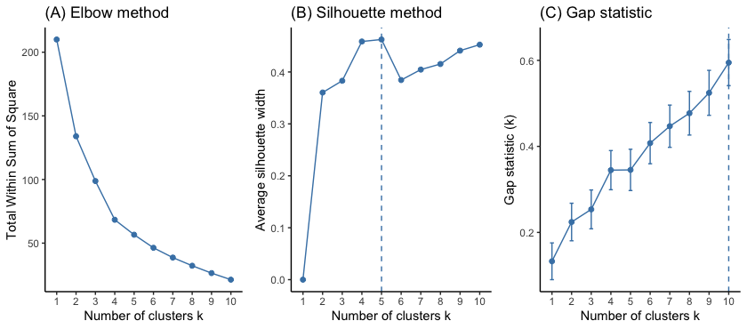
Then, perform the agglomerative HC using the `hlcust()`function for the two methods that resulted to have a larger **agglomerative coefficient**, but first compute the *dissimilarity values* with the `dist()` function using the *Euclidean* method, also call distance matrix following the pythagorean theorem.
```{r}
d   <- dist(mydata, method = "euclidean") # distance matrix using Euclidean method (dissimilarity matrix?)
hc1 <- hclust(d, method = "ward.D2")      # HC using the Ward's method
hc2 <- hclust(d, method = "complete")     # HC using the Complete method
sub_grp0 <- cutree(hc1,k=5)               # using 5 as the number of clusters to extract
sub_grp1 <- cutree(hc2,k=5)
table(sub_grp0) # number of members in each cluster in Ward solution
table(sub_grp1) # number of members in each cluster in Complete solution
```
Plot the **dendogram** highlighting the 5 clusters previously obtained
```{r, echo = FALSE}
p4 <- fviz_dend(hc1,k=5, horiz = FALSE, rect = TRUE, rect_fill = TRUE, rect_border = "jco",
                k_colors = "jco")+
  ggtitle("Dendogram using Ward's solution")+theme_classic()
p5 <- fviz_dend(hc2,k=5, horiz = FALSE, rect = TRUE, rect_fill = TRUE, rect_border = "jco",
                k_colors = "jco")+
  ggtitle("Dendogram using Complete solution")+theme_classic()
gridExtra::grid.arrange(p4,p5, nrow=1)
```
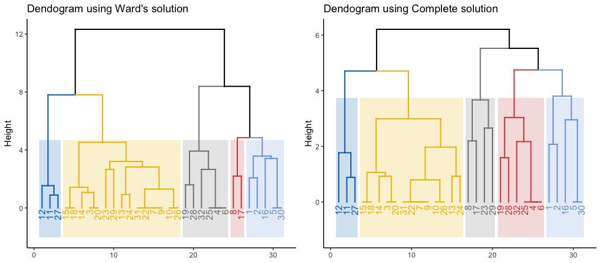

In addition the `pvclust()` function provides *p*-values for HC based on multiscale bootstrap resampling. Clusters higly supported by the data will have conversely larger *p*-values. *p*-values are computed for each of the clusters. The following figure encloses the clusters that are significant at a given *alpha* value using the `pvrect` function.
```{r}
mydata2 <- data.frame(t(mydata))
fit <- pvclust(mydata2, method.hclust = "ward.D", method.dist = "euclidean")
plot(fit) + pvrect(fit, alpha=0.99)
fit <- pvclust(mydata2, method.hclust = "complete", method.dist = "euclidean")
plot(fit) + pvrect(fit, alpha=0.90)
```
Ward's Solution            |  Complete Solution
:-------------------------:|:-------------------------:
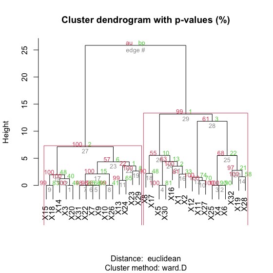  |  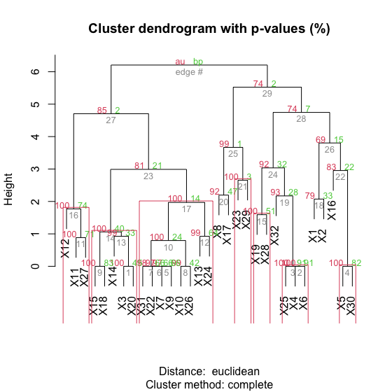

From the left figure above we can identify that the two larger cluster are significant with an alpha of 0.99 using the Ward's method, while the complete solution results in more and smaller clusters.

#### Partitioning Around Medoids (PAM)

Partitioning Around Medoids (PAM) is an unsupervised machine learning algorithm for clustering analysis inside the family of HC methods that searches for *k* representative objects in a data set (*k* medoids) and then follows to assign each object to the closest medoids thus creating clusters. It can be considered as an alternative to the Ward's solution clustering and it is arguably a more robust methodology than the *k* means approximation because is less sensitive to noise and outliers due to the use of medoids as cluster centers, the medoids are objects/observation within each cluster for which average dissimilarity between it and all of the other members of the cluster is minimal, instead of means or centroids. Nonetheless and by using this methodology, we can obtain *k* representative objects that minimize the sum of the dissimilarities of the observations to their closest representative object.
```{r}
# Ward's Solution
p6 <- fviz_cluster(list(data=mydata, cluster = sub_grp0))+
  ggtitle("Cluster Solution - Ward's method")+theme_classic()
# PAM's Solution
pam.res0 <- pam(mydata, 5, metric = "euclidean", stand = FALSE) # using the pam function
print(pam.res0)
p7 <- fviz_cluster(list(data=mydata, cluster = pam.res0$clustering))+
  ggtitle("Cluster Solution - PAM method")+theme_classic()
gridExtra::grid.arrange(p6,p7, nrow=1)

Medoids:
   ID  no_rotate rotate_body rotate_map head_light  landmark navigation       zoom
30 29  1.2793762  -1.3378949 -0.8974162 -1.5893542  1.670897 -0.6076631  1.2861607
31 30 -0.6711482   0.7709903  0.6922925  0.2132061 -0.648408 -0.6076631 -0.7761314
25 24 -0.6711482   0.7709903 -0.8974162  0.2132061 -0.648408  1.6528435  1.2861607
8   8 -0.6711482  -1.3378949  1.4871469 -1.5893542  1.670897  0.1458391  1.2861607
27 26  1.9295510  -1.3378949 -0.8974162  0.8140595 -0.648408 -0.6076631 -0.7761314
```
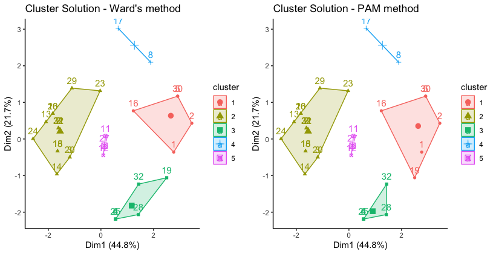
The printed output above shows the cluster medoids and the clustering vector indicating the cluster to which each point is allocated.

#### Evaluating the quality of the partition

The following code shows a way to evalulate the quality of the partition by the explained variance percentage of the proposed model and number of clusters.
```{r}
# Ward's Solution
model <- kmeans(mydata, centers = 5) 
BSS <- model$betweenss # Between Sum of Squares 
TSS <- model$totss     # Total Sum of Square
BSS/TSS*100            # Explained percentage

[1] 71.6807

# PAM's Solution
model_PAM <- kmeans(mydata, centers = pam.res0$medoids)
BSS <- model_PAM$betweenss # Between Sum of Squares 
TSS <- model_PAM$totss     # Total Sum of Square
BSS/TSS*100                # Explained percentage

[1] 73.20949
```
#### Adding classification to the original data

The next step will be to add the classification information to the original data
```{r}
mydata0 <- data.frame(mydata)                           # data frame without appending the groups
mydata3 <- data.frame(cbind(mydata,cluster = sub_grp0)) # append cluster information from Ward's Solution to original data
mydata4 <- data.frame(cbind(mydata,cluster = pam.res0$clustering)) # append cluster information from PAM's Solution
df01 <- melt(mydata3, id.var = "cluster")
df02 <- melt(mydata4, id.var = "cluster")
df01$cluster <- as.character(df01$cluster)
df02$cluster <- as.character(df02$cluster)
```
See Silhouette Figure ~ (To be continued...)

#### Descriptive Analyses

The following visual analyses will only focus on the classification done with the PAM's algorithm which was found to be slightly superior than the Ward's Solution

```{r}
set_var01 <- c('head_light','rotate_body','rotate_map')
set_var02 <- c('no_rotate','landmark','navigation','zoom')
mini_set01 <- subset(df02,df02$variable %in% set_var01)
mini_set02 <- subset(df02,df02$variable %in% set_var02)
p00 <- ggplot(data = mini_set01, aes(x=variable, y=value)) +
  geom_boxplot(aes(fill = cluster),outlier.size = 1) +
  facet_wrap( ~ cluster, scales="free", ncol = 2) +
  xlab(label = NULL) + ylab(label = NULL) + ggtitle("Boxplots for 5 Navigation Groups") +
  guides(fill=guide_legend(title="Groups"))+theme_cleveland()
p00A <- ggplot(data = mini_set02, aes(x=variable, y=value)) +
  geom_boxplot(aes(fill = cluster),outlier.size = 1) +
  facet_wrap( ~ cluster, scales="free", ncol = 2) +
  xlab(label = NULL) + ylab(label = NULL) + ggtitle("Boxplots for 5 Navigation Groups") +
  guides(fill=guide_legend(title="Groups"))+theme_cleveland()
```
1st Set of Variables       |  2nd Set of Variables
:-------------------------:|:-------------------------:
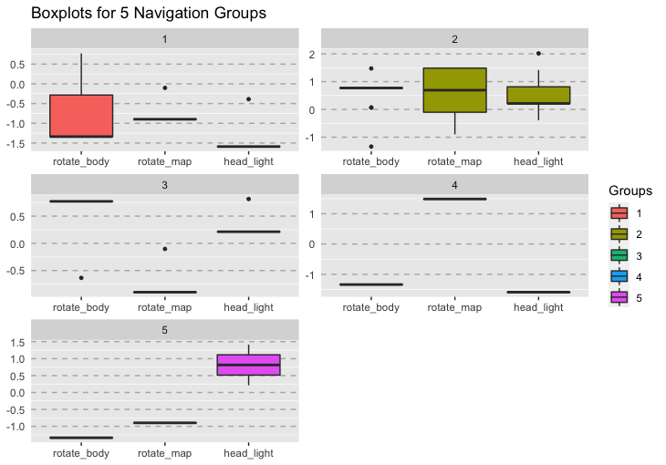  |  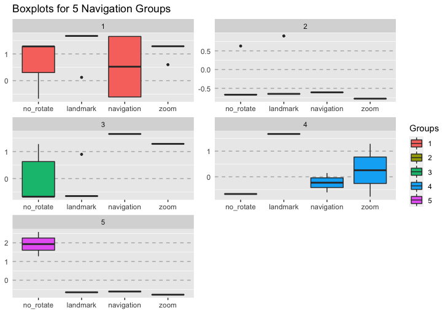

Following these results it can be possible to further investigate which variables are significantly different and even opposite between the largest groups (see Dendogram). For doing it **Group 5** (*Blue*) and *Group 2* (*Yellow*) were relabeled as *A*, thus conforming the cluster in the left side, and **Group 1** (*Pale blue*), **Group 3** (*Grey*) and **Group 4** (*Red*) were relabeled as *B*, thus conforming the cluster in the right side.
```{r}
gr1 <- c(2,5); gr2 <- c(1,3,4)
mydata4$new_cluster <- c(NA)
for (i in 1:nrow(mydata4)) {
  if(mydata4$cluster[i] %in% gr1){
    mydata4$new_cluster[i] <- c('A')
  }else if(mydata4$cluster[i] %in% gr2){
    mydata4$new_cluster[i] <- c('B')
  }
}
df03 <- melt(mydata4, id.var = "new_cluster")
df03$new_cluster <- as.character(df03$new_cluster)
```
After doing it so the bar plots for the two largest groups identified is as follows
```{r}
mini_set03 <- subset(df03,df03$variable %in% set_var01)
mini_set04 <- subset(df03,df03$variable %in% set_var02)
p000 <- ggplot(data = mini_set03, aes(x=variable, y=value)) +
  geom_boxplot(aes(fill = new_cluster),outlier.size = 1) +
  facet_wrap( ~ new_cluster, scales="free", ncol = 2) +
  xlab(label = NULL) + ylab(label = NULL) + ggtitle("Boxplots for 2 Largest Groups") +
  scale_y_continuous(breaks = seq(-2.5,2.5,0.5))+
  guides(fill=guide_legend(title="Groups"))+theme_cleveland()
```
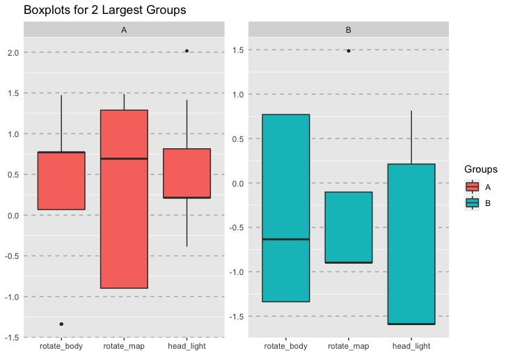

```{r}
Table: Comparison between the two largest groups that resulted of the agglomerative HC model with the PAM algorithm for 3 variables: head_light, rotate_body and rotate_map
```
| Variable             | A | Relation | B |   p   |
|----------------------|:-:|:--------:|:-:|:-----:|
| rotate_body (轉身體) | + |     >    | - | 0.000 |
| rotate_map (轉地圖)  | + |     >    | - | 0.002 |
| head_light (頭燈)    | + |     >    | - | 0.005 |

```{r}
p000A <- ggplot(data = mini_set04, aes(x=variable, y=value)) +
  geom_boxplot(aes(fill = new_cluster),outlier.size = 1) +
  facet_wrap( ~ new_cluster, scales="free", ncol = 2) +
  xlab(label = NULL) + ylab(label = NULL) + ggtitle("Boxplots for 2 Largest Groups") +
  scale_y_continuous(breaks = seq(-2.5,2.5,0.5))+
  guides(fill=guide_legend(title="Groups"))+theme_cleveland()
```
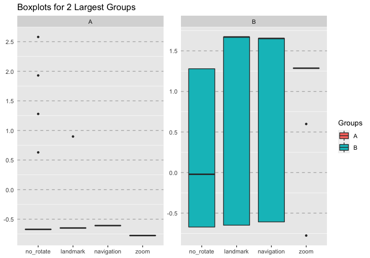
```{r}
Table: Comparison between the two largest groups of the HC model for no_rotate, landmark, navigation and zoom
```

#### Labeling the two major groups

For describing each of the two major groups first we will focus on the variables *rotate_body*, *rotate_map* and *head_light*; for these variables the larger scores were consistently identified for group A, thus subjects classified in group A actively assessed their position in the space in relation to the cues provided by GoogleMaps by rotating their bodies in order to identify the direction of the blue beam that indicates their front as well as rotating the map to match known topographical features of the environment. On the other hand, subjects in group B generally don't rotate their body as a strategy for knowing their direction and significantly checked less the direction of the blue beam. From these observations we could temptatively say that the navigation strategy of group A heavily relies on internal, local and cues with reference to the self, while the the strategy of group B relies on external, global and relationships of the objects in the environment.

Secondly, we will focus on the variables *no_rotate*, *landmark*, *navigation* and *zoom*; for these variables the larger scores were consistently identified for group B, this group doesn't perform rotations, thus scoring higher in this behavior; additionaly, actively uses the landmarks displayed in the app and zoom in the image relatively more than group A. The above confirms our initial thoughts on the two main characteristics of these groups in the sense that A relies on local and egocentric cues to larger extent while B relies on global and allocentric cues to a larger extend.

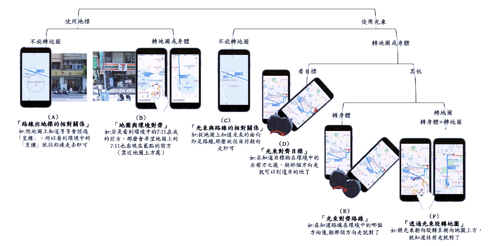

From what we have discussed so far the strategies that best represent these groups in the previous visual representation presented in MTL's thesis are: A combination of the strategies (B) and (F) depcited in the picture above for group **A** in our results and a combination of the strategies (A) and (C) for group **B**.
